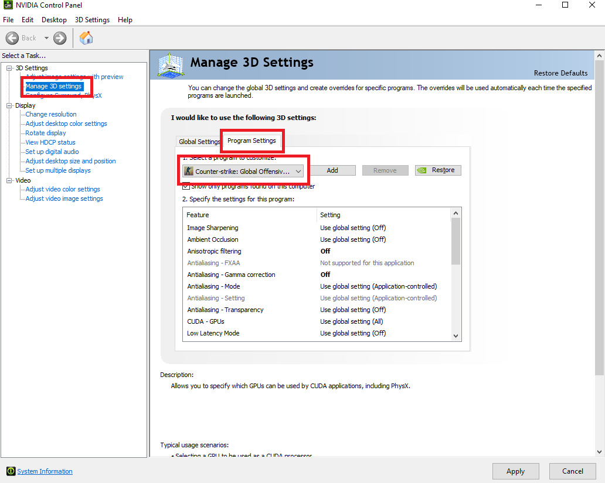
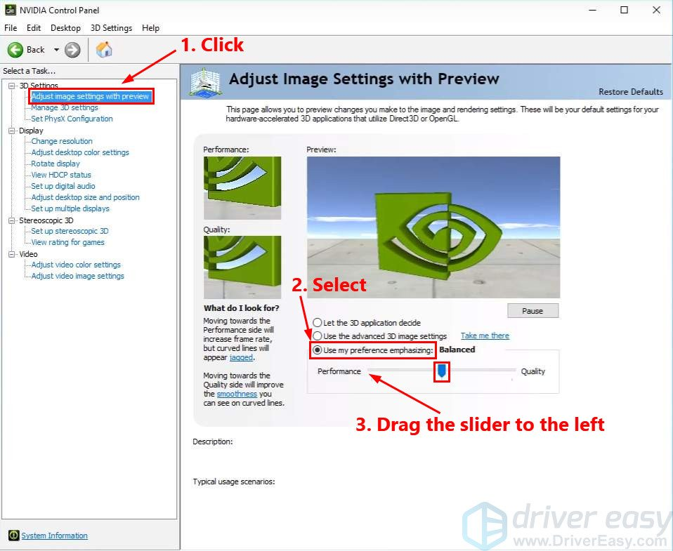
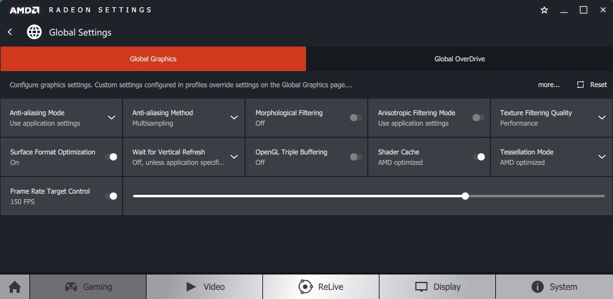

# FPS

FPS(frames per second) is used to measure the frame rate. In simple terms, it is the number of consecutive full-screen images that can be displayed each second. It is a common convention used in video-capture and playback and definitely games which have to load a lot number of frames or images each second.

On an average, the human eye can process 12 separate images per second. This means 12 FPS can display motion, but will appear choppy. Once the frame rate exceeds 12, the frames appear less discrete and start to blur together.

Now coming to the important part, which is games. FPS is also used to measure the frame rate of video games. The maximum frame rate is generally determined by a combination of the graphics settings and the GPU. For example, if you are running a new grame on an old computer, you may have to reduce the quality of graphics to maintain a higher frame rate. If you have a new computer with a powerful video card, you may be able to increase the graphics settings without reducing the FPS.


## How to check FPS in CS GO?

1. Launch your game.
2. Go to Settings by clicking the `Settings Cog` at the bottom of the navigation panel on the left-hand side.
3. Among the tab options mentioned above, go to `Game Settings`.
4. Scan through the list of options.
5. In the option to `Enable Developer Console`, select `YES`.
6. Once enabled, open your developer console from anywhere by clicking **` key** on your keyboard.
7. In the console opened, type the command `net_graph 1`. Now you would be able to see a whole bunch of options out of which one corresponding to the key `fps` will be the FPS that is possible with your PC.
8. To check the actual FPS, launch a deathmatch by clicking on the `Play Cog` at the top of the navigation panel on the left-hand side, selecting the `Death Match` option in the tab options and then clicking on the play button at the bottom right.
9. Once the death match starts, play for a minute to get the average FPS that you are getting.


## Recommended FPS Value for Smooth Gaming

FPS is something which is `the higher the better`. If on a new laptop with a powerful video card, then there is no need to limit the FPS value. But on an older laptop, it is better to limit the FPS required. With a FPS of `60 or above`, you can easily and smoothly enjoy playing CS GO.

Run the following command to limit the FPS to 60 if you are playing on an older laptop.
```
  fps_max 60
  fps_max_menu 60
```


## How to increase FPS in CS GO?

With an older laptop, run the following set of commands to increase the FPS. It only has to be done once provided you are not clearing the entire `steam` directory of your laptop.

Run these simple console commands. 
1. `r_drawparticles 0` - This disables many small particles in the game, decreasing the load on the PC.
2. `muzzleflash_light 0` - This disables the flash while shooting.
3. `r_eyemove 0` - This makes the eyes motionless.
4. `r_gloss 0` - This removes the shine from the eyes.
5. `func_break_max_pieces 0` - This removes some tiny objects in the virtuality.
6. `mat_disable_bloom 1` - This removes the special bloom effect in the virtuality, so the picture on the screen will be slightly simpler.
7. `cl_downloadfilter nosounds` - This blocks downloads of custom sounds from the server.
8. `dsp_slow_cpu 1` - This makes the sound quality worse. This is not the most efficient way to improve game performance, so use it as a last resort.

Now open the `Settings` by clicking on the `Settings Cog` at the bottom of the navigation panel on the left-hand side. Among the tab options mentioned above, go to `Video Settings`. Then select `Advanced Video` among the next set of tab options. Then make the options available as follows to achieve the maximum possible FPS in your game.
1. `Global Shadow Quality - Low / Very Low`
2. `Model / Texture Detail - Low`
3. `Effect Detail - Low`
4. `Shader Detail - Low`
5. `Multicore Rendering - Enabled`
6. `Multisampling Anti-Aliasing Mode - None`
7. `Texture Filtering Mode - Bilinear`
8. `FXAA Anti-Aliasing - Disabled`
9. `Wait for Vertical Sync - Disabled`
10. `Motion Blur - Disabled`

If your PC or Laptop has a NVIDIA Graphics Card, then there is something additional you can do to increase the FPS.Open the `NVIDIA Control Panel`.  
On the left side panel, select `3D Settings` and then select `Manage 3D Settings`. Then select `Program Settings` from the center of the panel. From the dropdown available, select `Counter Strike Global Offensive`.

Make the options available as follows to achieve the maximum possible FPS in your game and click on `Apply` at the bottom right.
1. `Anisotropic Filtering - Off`
2. `Antialiasing-Gamma Correction - Off`
3. `Maximum Pre-rendered Frames - 1`
4. `Power Management Mode - Prefer Maximum Performance`
5. `Preferred refresh rate - Highest Available`
6. `Texture Filtering – Anisotropic sample optimization - Off`
7. `Texture Filtering -negative LOD bias - Allow`
8. `Texture Filtering-Quality - High Performance`
9. `Texture Filtering-Trilinear Optimization - Off`
10. `Threaded Optimization - On`
11. `Triple Buffering - Off`
12. `Verticle Sync - Off`

On the left side panel, click on `Adjust image settings with preview`. Then select `Use my preference emphasizing` and drag the slider to the `LEFT`.
 

If your PC or Laptop has AMD Graphics Card, then there is something additional that you can do to increase the FPS. Open the `AMD Radeon Settings`. Select `Global Settings` in the options available. Move to `Global Settings` using the navigation bar at the top.

Make the options available as follows to achieve the maximum possible FPS in your game.
1. `Anti-aliasing Mode - Use application settings`
2. `Anti-aliasing Method - Multisampling`
3. `Morphological Filtering - Off`
4. `Anisotropic Filtering Mode - Use application settings`
5. `Texture Filtering Quality - Performance`
6. `Surface Format Optimisation - On`
7. `Wait for Vertical Refresh - Always Off`
8. `OpenGL Triple Buffering - Off`
9. `Shader Cache - Yes/No(YES if your windows is installed on a SSD hard or NO if u have a HDD)`
10. `Tessellation Mode - AMD Optimized`
11. `Maximum Tessellation Level - Off`
12. `Power Efficiency - Off`
13. `GPU Workload - Graphics`
14. `Chill - Off`

If you are running your game on Windows, then you will have to follow these additional steps for improving the performance.
1. Open `Control Panel`.
2. Search for `Advanced System Settings` at the top right.
3. In the panel opened, click on `Advanced` in the top navigation tab options.
4. Under `Performace`, click on `Settings`.
5. In the panel opened, select `Visual Effects` in the top navigation tab options.
6. Select the option `Adjust for Best Performance` and click on `Apply` in the bottom right.
7. Search for `Power Options` in the `Control Panel`.
8. In the `Preferred Plans`, select `High Performance`.
9. From anywhere, press `WINDOWS + R` on the keyboard.
10. In the opened panel, type `msconfig` and press `ENTER`.
11. In the opened panel, select `Startup` from the top navigation tab options.
12. Uncheck everything from there. 
